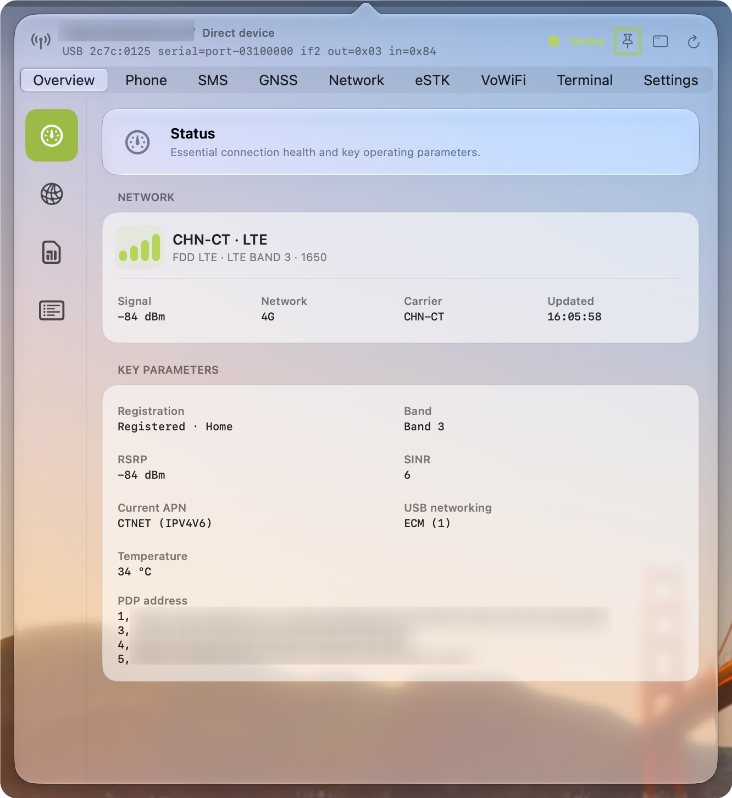
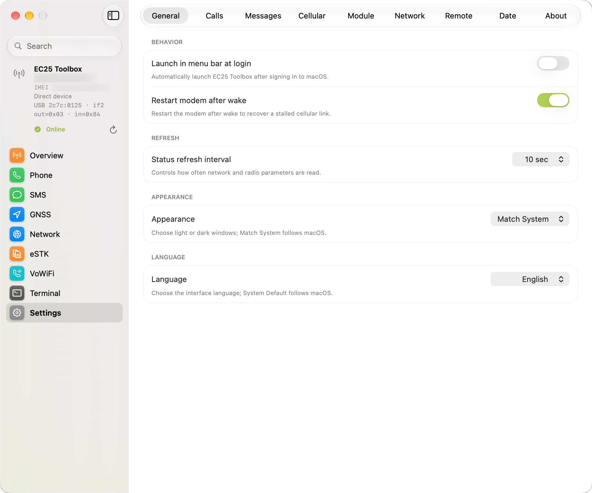
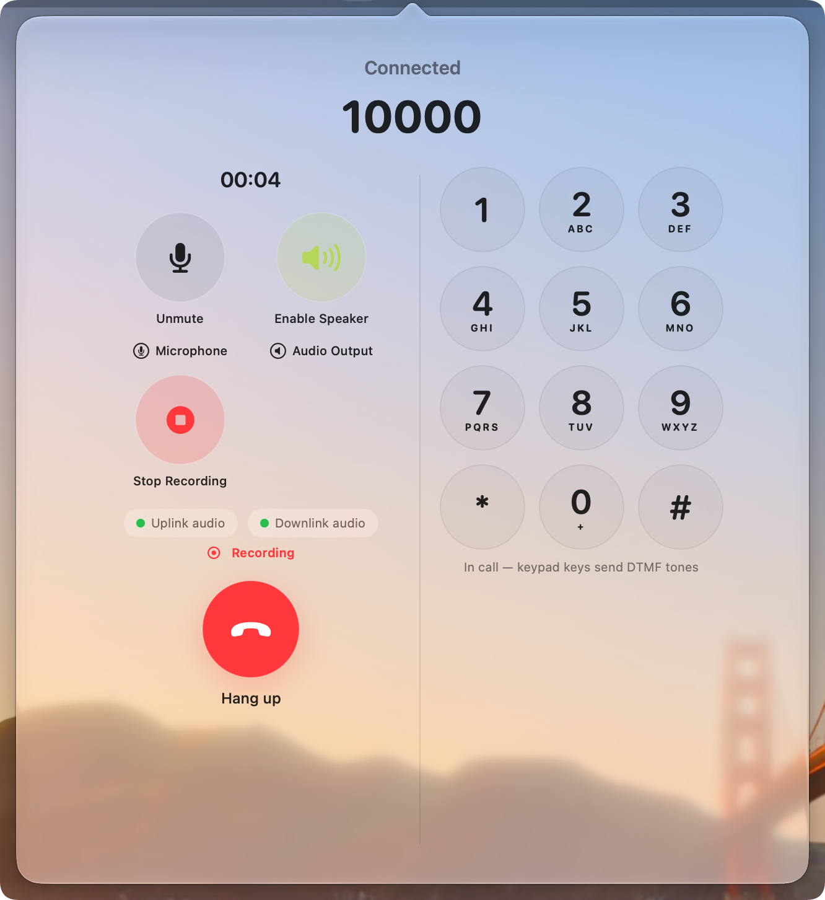

<p align="center">
  English | <a href="README_ZH.md">简体中文</a>
</p>

<p align="center">
  
</p>

<h1 align="center">EC25 Toolbox</h1>

<p align="center">
  面向 EC25 类蜂窝模块、短信、通话、GNSS、网络、eUICC 与远程管理的原生 macOS 控制中心

  A native macOS control center for EC25-class cellular modems, messaging, calls, GNSS, networking, eUICC, and remote management
</p>

<p align="center">
  
  
  
  
  <a href="LICENSE"></a>
</p>

EC25 Toolbox is a native macOS menu bar utility for Quectel EC25, compatible Baiwang USB modems, and compatible first-generation DJI Cellular Dongle (LTE USB Modem) hardware. It communicates through IOKit and IOUSBHost and combines modem status, SMS, calls, SIM security, GNSS, networking, remote management, eUICC operations, and experimental VoWiFi in one SwiftUI application.

Current source version: **27.1** · Bundle identifier: **`ing.fuyaoskyrocket.ec25toolbox`**

> [!WARNING]
> **eSTK/eUICC, VoWiFi, and the optional QDC507 voice runtime are experimental.** Firmware, eUICC, SIM, carrier, access-network, and hardware differences can cause failures or data loss. Back up critical data and keep an independent recovery path before changing profiles, module configuration, or voice-routing state.

> [!NOTE]
> This README describes the current source tree and its focused automated coverage. Build and test results do not constitute hardware, carrier, eSIM-provider, remote-media, system-helper deployment, or end-to-end VoWiFi acceptance.

## 项目优势与特点 | Project Advantages and Key Features

- **纯 SwiftUI 界面 / Pure SwiftUI UI** — 界面页面以 SwiftUI 为主体，使用原生 `TabView`、`NavigationSplitView`、SF Symbols、系统控件和本地化资源；仅在菜单栏、`NSPopover`、原生窗口及系统服务等 macOS 集成边界使用轻量 AppKit bridge。The user-facing page layer is SwiftUI-first and stays within native Apple UI patterns, with AppKit limited to system-integration boundaries.
- **原生 Liquid Glass / Native Liquid Glass** — 采用系统拥有的 `tabBarOnly` Tab 表面、`glassEffect`、原生 popover 材质和透明标题栏，让菜单栏 popover 与独立窗口保持 macOS 原生的 Liquid Glass 交互。It avoids web-style chrome and layered fake glass in favor of the system Liquid Glass surface and interaction model.
- **纯原生 macOS / Fully Native macOS** — 使用 Swift、SwiftUI、AppKit、IOKit、IOUSBHost、CoreAudio、AudioUnit、Network 和 ServiceManagement 等 Apple 原生技术栈；不依赖 Electron、Node.js、libusb 或浏览器运行时。The application is a native macOS utility rather than an Electron, Node.js, libusb, or web-runtime wrapper.
- **DJI Cellular 模块与 TD-LTE 无线数据终端管理 / DJI Cellular Dongle and TD-LTE Wireless Data Terminal Management** — 支持兼容的第一代 DJI Cellular Dongle（LTE USB Modem；TD-LTE 无线数据终端）识别、USB VID/PID 身份修改，以及修改后的模块管理。The native transport recognizes DJI `2ca3:4006` and EC25 `2c7c:0125`; after a supported identity-only conversion, the same management stack continues to provide modem status, SMS, calls, GNSS, networking, module configuration, eUICC, and remote-management features.
- **可逆的 USB 身份修改 / Reversible USB Identity Modification** — 所有修改都经过用户确认，并保留原始接口标志；应用先备份 `QCFG` 配置，再执行重启、重新连接、目标验证和失败回滚。This is a configuration-level VID/PID conversion, not firmware flashing or physical hardware modification.
- **IMEI 索引的多模块管理 / IMEI-Indexed Multi-Modem Management** — 每个物理模块拥有独立的长期 `ModemStore`，连接后使用 IMEI 作为稳定模块索引，分别维护设备选择、备注、绑定状态、短信、通话和通知来源。Each physical modem keeps an independent session and persistent management context instead of sharing mutable state across devices.
- **完整的蜂窝工作流 / End-to-End Cellular Workflow** — 从原生 USB AT 通信、信号与网络状态，到 SMS、电话、GNSS、音频、eUICC/eSTK、VoWiFi 实验客户端和加密远程管理，EC25 Toolbox 将常用蜂窝模块能力集中在一个 macOS 菜单栏工具中。Experimental eSTK/eUICC, VoWiFi, and optional QDC507 voice-runtime paths remain explicitly hardware-, firmware-, carrier-, and provider-dependent.
- **稳定的原生桌面体验 / Predictable Native Desktop Surfaces** — 菜单栏 popover 固定为 `640×700 pt`，独立窗口固定为 `993×827 pt`，窗口侧栏固定为 `216 pt`，并通过九个原生主 Tab 提供 Overview、Phone、Messages、GNSS、Network、eSTK、VoWiFi、Terminal 和 Settings。Both surfaces keep independent navigation state and use localized, searchable settings-style presentation.

## Current capabilities

- Discovers the EC25-compatible USB identity `2c7c:0125` and the original first-generation DJI identity `2ca3:4006` through the native USB transport.
- Provides a confirmation-gated USB identity workflow that preserves reported interface flags, backs up configuration, restarts and verifies the module, and rolls back on failure when the reported composition is supported. It does not flash firmware or change physical hardware.
- Uses one long-lived, IMEI-indexed `ModemStore` per physical module. Device selection, notes, bind/unbind state, complete deletion of retained unbound entries, SIM-scoped content, and module-routed notifications remain separate for each module.
- Uses a continuous AT input reader with line framing, prompt handling, final-response collection, unsolicited-event classification, and reconnect-aware event delivery. Command transactions and modem events no longer compete for the USB input pipe.
- Displays cellular identity, signal and registration state, radio quality, serving-cell data, SIM state, PDP/APN profiles, USB networking, and module configuration.
- Reads, sends, deletes, and polls text and PDU-mode SMS. GSM 7-bit, UCS2, concatenation, binary-message classification, verification-code extraction, attributed links, notifications, and schema-v3 logical/transport archives are included.
- Provides deterministic call state, caller identity merging, Contacts lookup, call history, DTMF, automatic-answer inspection, read-only SIM phonebook capability probing, and a native call surface with a persistent keypad.
- Provides native bidirectional call audio with endpoint matching, per-device sample rates, bounded resampling, preflight checks, microphone/output selection, mute and speaker controls, imported ringtones, and local recordings. System Audio input is direct-host-only and excludes the app's own playback.
- Provides GNSS source fallback, USB NMEA parsing, location history, MapKit presentation, network-interface and route diagnostics, traffic history, recovery policy, diagnostic snapshots, date/time display preferences, appearance selection, and a scoped SMAppService/XPC system helper.
- Supports encrypted remote management on approved private LAN and Tailscale addresses, including unsolicited modem events, USB NMEA relay, bounded 8 kHz duplex call-audio frames, and full host-session repair after a confirmed USB-identity-changing reboot.
- Provides a fixed `640×700 pt` menu bar popover and a fixed `993×827 pt` standalone window with an independent `216 pt` sidebar. Both surfaces expose all nine primary sections: Overview, Phone, Messages, GNSS, Network, eSTK, VoWiFi, Terminal, and Settings.
- Uses native `tabBarOnly` navigation, page-local search, shared parameter grids, localized empty states, and independent popover/window navigation selections.
- Bundles a patched lpac 2.3.0 executable for eSTK/eUICC operations; users do not need to install lpac separately.

## Screenshots

The screenshots below show the English menu bar popover, standalone settings window, live call surface, and compact floating call panel.

<table>
  <tr>
    <td align="center" width="50%">
      
      <br><sub>Menu bar popover · Overview</sub>
    </td>
    <td align="center" width="50%">
      
      <br><sub>Standalone window · Settings</sub>
    </td>
  </tr>
</table>

<p align="center">
  
  <br><sub>Live call surface · audio controls, recording status, and DTMF keypad</sub>
</p>

<p align="center">
  
  <br><sub>Compact floating call panel</sub>
</p>

## DJI Cellular Dongle compatibility

EC25 Toolbox originally began as a way to reuse the LTE USB modem inside the first-generation [DJI Cellular Dongle (LTE USB Modem)](https://store.dji.com/uk/product/dji-cellular-dongle-lte-usb-modem). The transport recognizes both `2ca3:4006` and `2c7c:0125`. When a module reports a supported `QCFG usbcfg` composition, Settings can apply a reversible identity-only conversion using the same backup, restart, verification, and rollback pipeline as other module configuration changes.

The USB ID alone does not prove compatibility. Firmware, USB composition, interface numbering, endpoints, and AT behavior must match the transport's expectations. This is a community hardware-reuse path, not an official DJI mode; DJI Cellular Dongle 2 has not been validated. The source-level flow is covered by focused tests, but real-device acceptance is still required.

## Experimental features

### Optional QDC507 module voice runtime

Some QDC507 firmware reports `AT+QPCMV=?` support but rejects `AT+QPCMV=1,2`. For that specific case, Settings provides a separate opt-in backend based on the [MaVo](https://github.com/moluncn/mavo) runtime pinned to commit `0443dfdaf8aec086fd76ba2ee9152fd908114524`.

The application does not bundle these artifacts. After explicit consent, it downloads and verifies the three deployed files plus the upstream manifest, GPL-2.0 text, and report, using exact sizes and SHA-256 values. The cache is kept under Application Support. After separate ADB and preparation confirmations, the native IOKit/IOUSBHost client binds to the same physical module, requires root and exactly Linux `3.18.44`, copies files to module temporary storage, and starts the owned route helper only for an active call. The kernel modules are not hot-unloaded.

This path preserves the current VID/PID and unrelated USB functions, enables only the missing ADB/UAC functions, and verifies `IMS=1` and `volte_disable=0`. It is direct-device-only, does not flash firmware or persist runtime files on the module, and has not passed real-device or carrier-call acceptance. See [`ThirdParty/MaVo-NOTICE.md`](ThirdParty/MaVo-NOTICE.md) for hashes, source-correspondence limits, licensing, and redistribution obligations.

### eSTK and eUICC

The eSTK page uses the bundled lpac source through an ndJSON standard-I/O bridge and the modem's APDU channel. Depending on firmware, it uses `AT+CCHO`/`AT+CGLA`/`AT+CCHC` or falls back to `AT+CSIM`.

The current UI and transport cover eUICC detection, chip information, EID/EUICCInfo2/EUM/CI inspection, profile listing and management, activation-code import from clipboard or QR image, SM-DS discovery, default SM-DP+ management, notification processing, APDU diagnostics with redaction, and configurable APDU compatibility settings. Profile labels, phone numbers, and tags are stored locally by EID and ICCID and are not written to the card.

Profile downloads, switching, deletion, notification processing, and recovery remain dependent on the card, firmware, bridge, and provider.

### VoWiFi and IMS messaging

The experimental VoWiFi implementation performs USIM/ISIM access, AKA, IKEv2/EAP-AKA, ESP NAT traversal, P-CSCF discovery, IMS registration, and IMS SMS processing inside EC25 Toolbox.

It is not macOS system Wi-Fi Calling, does not create a system VPN, and does not provide voice or emergency calling. Carrier provisioning, ePDG policy, SIM contents, NAT traversal, and IMS security requirements can prevent registration or message delivery.

## Requirements and permissions

- macOS 26 or later
- Xcode containing the macOS 27 SDK
- Swift 6.2 or later
- A Quectel EC25, compatible Baiwang modem, or compatible first-generation DJI Cellular Dongle exposing `2c7c:0125` or `2ca3:4006` and a readable EC25-style AT interface

The optional QDC507 backend additionally requires a directly connected rooted module, exactly Linux `3.18.44`, user-approved ADB access, and network access for the one-time pinned runtime download. It is not used by the standard `QPCMV` backend.

Homebrew, Node.js, Electron, libusb, Android platform-tools, and a separately installed lpac executable are not required.

The application uses:

- **Local Network** for encrypted direct/remote management on approved private LAN or Tailscale endpoints.
- **Contacts** for local caller and message-sender names.
- **Notifications** requested at launch or from Settings, never when a call is already ringing.
- **Microphone** only when a physical microphone is selected for call uplink.
- **System Audio Recording** only when System Audio is selected; this input is available only for a modem directly connected to the current Mac.

## Technology

| Area | Main technologies |
| :--- | :--- |
| Language and build | Swift 6.2, Swift Package Manager, macOS 27 SDK, focused C bridge code |
| Interface | SwiftUI, AppKit, SF Symbols, MapKit, Charts |
| Modem and audio | IOKit, IOUSBHost, CoreAudio, AudioUnit, AVFoundation |
| System integration | SystemConfiguration, ServiceManagement, Contacts, UserNotifications, Keychain |
| Remote management | Network framework, CryptoKit AES-256-GCM, private LAN, Tailscale |
| eUICC and VoWiFi | Patched lpac 2.3.0, APDU transport, IKEv2/EAP-AKA, ESP NAT-T, IMS SIP/SMS |

## Build and test

Run commands from the repository root. The project and release scripts are arm64-only.

### Focused tests

Resolve the active Xcode and SDK through `xcode-select`/`xcrun` instead of a fixed install path, and check that the SDK is a MacOSX 27 one before running:

```bash
export DEVELOPER_DIR="$(xcode-select -p)"
export MACOS_SDK="$(xcrun --sdk macosx --show-sdk-path)"
case "$MACOS_SDK" in *MacOSX27*.sdk) ;; *) echo "Expected a MacOSX27 SDK, got: $MACOS_SDK" >&2; exit 1;; esac
"$DEVELOPER_DIR/Toolchains/XcodeDefault.xctoolchain/usr/bin/swift" test \
  --disable-sandbox \
  --arch arm64 \
  --sdk "$MACOS_SDK" \
  -Xswiftc -plugin-path \
  -Xswiftc "$DEVELOPER_DIR/Platforms/MacOSX.platform/Developer/usr/lib/swift/host/plugins"
```

The bundled-lpac protocol test additionally needs `EC25_TEST_LPAC_PATH` to point to a compatible lpac executable.

### Package the application

```bash
./Tools/package_swiftui.sh
```

The script builds the application, the legacy IKE helper, and the SMAppService system helper; builds the bundled lpac executable; copies resources; removes extended attributes; applies ad hoc signatures; verifies the bundle; and writes:

```text
dist/EC25 Toolbox.app
```

The local package is ad hoc signed and not notarized. Helper registration, approval, upgrade, and removal require acceptance with a properly signed distribution build.

### Generate release archives

After packaging:

```bash
swift Tools/ec25.swift release --no-build
```

Applications, archives, checksums, and other generated release artifacts belong in the ignored `dist/` directory.

## Architecture

```text
NSStatusItem / NSPopover / native NSWindow
                    |
      SwiftUI + ModemSessionCoordinator
                    |
     one ModemStore per physical module
                    |
        +-----------+---------------------+
        |                                 |
 direct EC25Transport            encrypted remote v2
        |                        AT / events / NMEA / audio
 IOKit / IOUSBHost                        |
        |                                 |
        +---------------- EC25 modem -----+
        |                    |            |
 CoreAudio / AudioUnit   USB NMEA      AT / APDU
        |                                  |
 calls and recordings        eUICC / ISIM / USIM
                                           |
                   lpac ndJSON APDU/HTTP --+
                                           |
                 AKA -- IKEv2/EAP-AKA -- ESP NAT-T
                                           |
                                     IMS SIP and SMS

 IKE / SystemConfiguration <-> scoped SMAppService system helper
```

`ModemSessionCoordinator` owns discovery, selection, shared settings, module notes, and notification routing. Each physical module has one long-lived `ModemStore` that serializes its AT, polling, SMS, and call operations. The optional QDC507 backend uses a separate physical-module-bound ADB channel. Popover and standalone-window navigation selections are independent while host-local clipboard, recordings, status-item, and helper operations stay on their owning Mac.

## Data and privacy

Local SMS data is stored at:

```text
~/Library/Application Support/EC25 Toolbox/Messages/messages-v3.json
```

Optional mergeable iCloud Drive backups are stored under:

```text
iCloud Drive/EC25 Toolbox/Backups
```

Call recordings and imported ringtones remain in the local Application Support directory and are not uploaded through remote management or iCloud SMS backups. Remote pairing keys and saved SIM PINs use the macOS Keychain. Activation data, APDUs, bound-profile-package payloads, PINs, and private message or phone-number fields are redacted or excluded from user-facing diagnostics.

If enabled, the QDC507 runtime cache is stored under `~/Library/Application Support/EC25 Toolbox/VoiceRuntime/`; it is not bundled, uploaded, or synchronized. Runtime files copied to module temporary storage disappear after module restart.

## Remote management

A directly connected Mac can expose the encrypted service on:

- port `48525` for private LAN addresses
- port `48526` for Tailscale `100.64.0.0/10` addresses

Requests use AES-256-GCM authenticated encryption, a 60-second request lifetime, replay protection, and Keychain-backed pairing keys. The service does not intentionally bind to public Internet addresses. Protocol v2 carries modem events, USB NMEA, and bounded 8 kHz duplex call-audio frames. A reconnecting client can ask the direct host to rebuild the complete modem session after a confirmed USB-identity-changing reboot.

## Project layout

```text
Package.swift                         SwiftPM package definition
Sources/EC25Toolbox/                  Main application and feature code
Sources/EC25IKEHelper/                Legacy privileged IKE helper
Sources/EC25IKEHelperProtocol/       Legacy helper protocol
Sources/EC25SystemHelper/             SMAppService system helper
Sources/EC25SystemHelperProtocol/     Validated system-helper boundary
Sources/CVoWiFiCrypto/                C cryptographic bridge
Tests/EC25ToolboxTests/               Focused XCTest and Swift Testing coverage
Resources/                            Info.plist, localizations, and app icon
ThirdParty/lpac/                      Vendored and patched lpac 2.3.0 source
ThirdParty/MaVo-NOTICE.md             Optional runtime provenance and license boundary
Docs/                                 Feature and compatibility notes
Tools/package_swiftui.sh              Build, package, sign, and verify the app
Tools/ec25.swift                      Release archive helper
README.md / README_ZH.md              English and Simplified Chinese documentation
CHANGELOG.md / CHANGELOG_ZH.md        Net changes from the remote baseline
LICENSE                               GNU AGPL v3 license text
```

The vendored lpac source is based on commit `c2fcf5e4b21c712d54e35a11da2ad9ad134fb821` (`v2.3.0`). EC25-specific changes are documented in [`ThirdParty/lpac/EC25_PATCHES.md`](ThirdParty/lpac/EC25_PATCHES.md).

## Third-party components and references

- [lpac](https://github.com/estkme-group/lpac) provides the bundled LPA and eUICC implementation.
- [OpenEUICC](https://github.com/estkme-group/openeuicc) informs eUICC workflow and compatibility behavior.
- [EasyLPAC](https://github.com/creamlike1024/EasyLPAC) informs desktop eUICC metadata and interaction behavior.
- [ec25-manager](https://github.com/Nickspace114514/ec25-manager) provided early EC25 macOS management ideas.
- [MaVo](https://github.com/moluncn/mavo) provides the separately downloaded, fixed-commit QDC507 runtime artifacts; they are not bundled or vendored.
- [vowifi-go](https://github.com/boa-z/vowifi-go) and [vohive-collection](https://github.com/hzlmy2002/vohive-collection) are references for parts of the experimental VoWiFi work.

Review `ThirdParty/lpac/LICENSES`, `ThirdParty/lpac/REUSE.toml`, `ThirdParty/EasyLPAC-LICENSE`, `ThirdParty/VoWiFi-NOTICE.md`, `ThirdParty/MaVo-NOTICE.md`, and `ThirdParty/MaVo-MIT-LICENSE` before modifying or redistributing the application. Separately downloaded kernel modules carry independent GPL-2.0 obligations.

## Safety and limitations

- Use the application only with devices, subscriptions, networks, and accounts you are authorized to manage.
- Keep a carrier-supported recovery method before modifying eSIM profiles or module USB configuration.
- Do not rely on VoWiFi or experimental call audio for voice or emergency communications.
- USB configuration changes can disconnect and re-enumerate the module.
- Loading optional QDC507 kernel modules is non-persistent but can crash or restart an incompatible module; do not bypass model, root, kernel, identity, integrity, or ownership checks.
- Behavior varies by modem firmware, SIM/eUICC, carrier provisioning, macOS version, and access network.
- Build and automated-test success do not prove hardware, carrier, eSIM-provider, system-helper deployment, two-Mac remote media, or end-to-end VoWiFi acceptance.

## Changelog

See [CHANGELOG.md](CHANGELOG.md) for the current 27.1 net change relative to the remote `main` baseline.

## License

EC25 Toolbox is licensed under the [GNU Affero General Public License v3](LICENSE). Vendored components, referenced implementations, and separately downloaded runtime files retain their respective upstream terms; see the notices and license files under `ThirdParty/` before redistribution.
