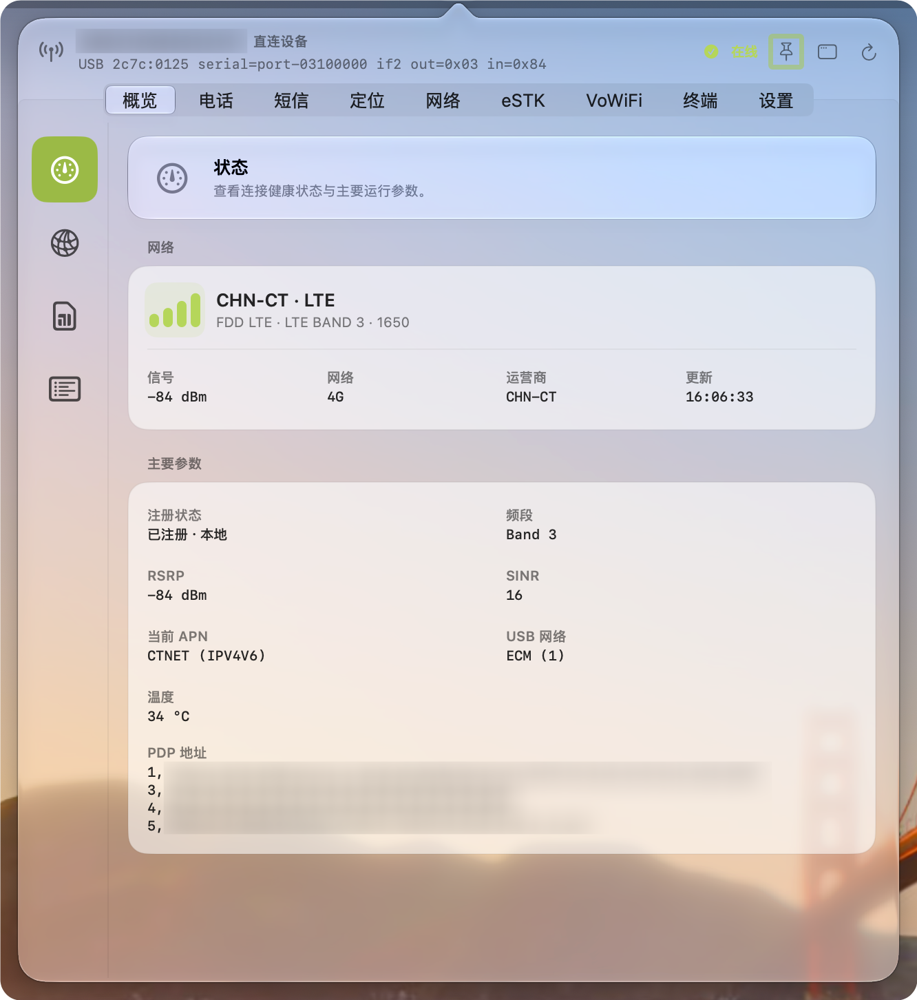
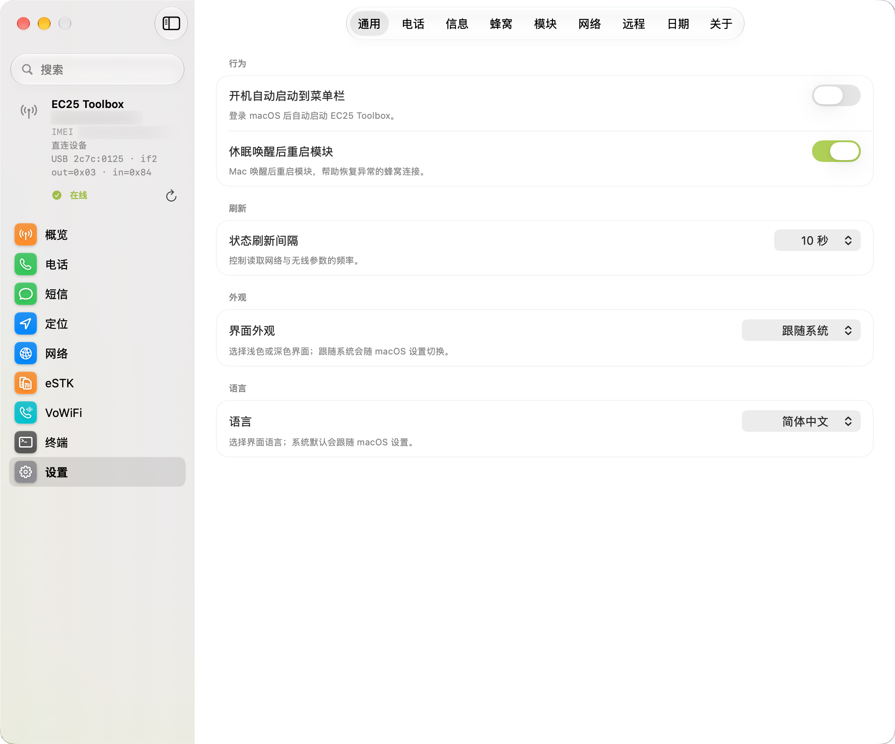
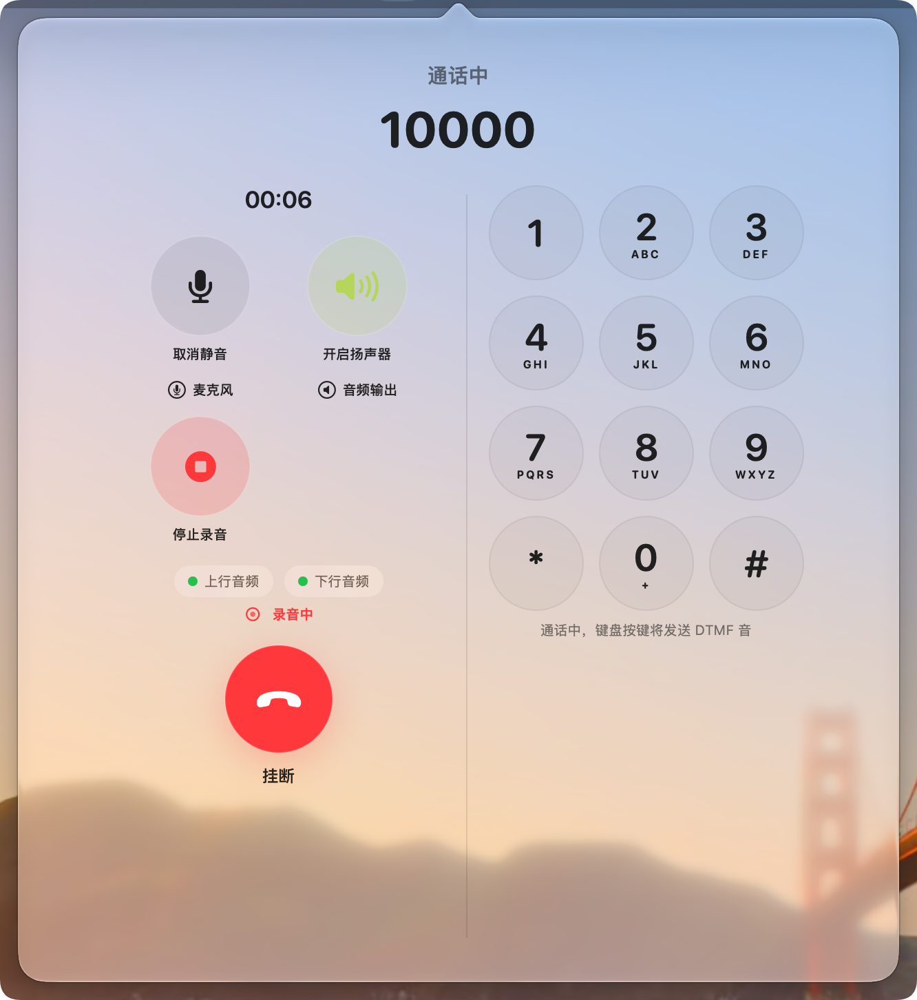

<p align="center">
  <a href="README.md">English</a> | 简体中文
</p>

<p align="center">
  
</p>

<h1 align="center">EC25 Toolbox</h1>

<p align="center">
  面向 EC25 类蜂窝模块、短信、通话、GNSS、网络、eUICC 与远程管理的原生 macOS 控制中心
</p>

<p align="center">
  
  
  
  
  <a href="LICENSE"></a>
</p>

EC25 Toolbox 是一款原生 macOS 菜单栏工具，面向 Quectel EC25、兼容的 Baiwang USB 模块以及兼容的第一代 DJI Cellular Dongle（LTE USB Modem）。应用通过 IOKit 与 IOUSBHost 通信，在一个 SwiftUI 应用中提供模块状态、短信、通话、SIM 安全、GNSS、网络、远程管理、eUICC 操作和实验性 VoWiFi 能力。

当前源码版本：**27.1** · Bundle Identifier：**`ing.fuyaoskyrocket.ec25toolbox`**

> [!WARNING]
> **eSTK/eUICC、VoWiFi 和可选 QDC507 语音运行时均为实验功能。** 模块固件、eUICC、SIM、运营商、接入网络和硬件差异可能导致失败或数据丢失。修改 Profile、模块配置或语音路由前，请备份关键数据并保留独立恢复方式。

> [!NOTE]
> 本 README 描述当前源码树及其聚焦自动化覆盖。构建和测试结果不等于真实硬件、运营商、eSIM 服务商、远程媒体、系统助手部署或端到端 VoWiFi 已通过验收。

## 当前能力

- 通过原生 USB transport 自动发现 EC25 兼容身份 `2c7c:0125` 和第一代 DJI 原始身份 `2ca3:4006`。
- 在模块报告的 USB 组合受支持时，提供用户确认后执行的 USB 身份流程：保留接口标志、备份配置、重启并验证，失败时回滚；不刷写固件，也不改变物理硬件。
- 为每个物理模块维护一个长期存在、按 IMEI 建立索引的 `ModemStore`。设备选择、备注、绑定/解绑、完全删除已解绑保留记录、按 SIM 隔离的内容和按模块路由的通知彼此独立。
- 使用连续 AT 输入读取器、行分帧、prompt 处理、最终响应收集、非请求事件分类和可重连事件分发；指令 transaction 与模块事件不再竞争 USB 输入管线。
- 展示蜂窝身份、信号和注册状态、无线质量、小区信息、SIM 状态、PDP/APN、USB 网络和模块配置。
- 读取、发送、删除和轮询文本/PDU 模式短信，支持 GSM 7-bit、UCS2、长短信拼接、二进制短信分类、验证码提取、富文本链接、通知以及 schema v3 逻辑/传输双层归档。
- 提供确定性的通话状态、来电身份合并、联系人匹配、通话记录、DTMF、自动接听检查、只读 SIM 电话簿能力探测，以及带常驻键盘的原生通话界面。
- 提供原生双向通话音频，包括 endpoint 匹配、按设备采样率、有界重采样、建链前检查、麦克风/输出选择、静音和扬声器、铃声导入及本地录音。系统音频输入仅支持直连当前 Mac，并排除本应用自身播放。
- 提供 GNSS 数据源回退、USB NMEA 解析、定位历史、MapKit 展示、网卡和路由诊断、流量历史、恢复策略、诊断快照、日期时间显示设置、外观选择，以及受限的 SMAppService/XPC 系统助手。
- 支持在经批准的私有局域网和 Tailscale 地址上进行加密远程管理，包括非请求模块事件、USB NMEA 转发、有界 8 kHz 双向通话音频帧，以及确认修改 USB 身份并重启后的完整宿主会话修复。
- 提供固定 `640×700 pt` 的菜单栏弹窗和固定 `993×827 pt` 的独立窗口，窗口使用独立的 `216 pt` 侧边栏。两种表面均提供九个主功能区：概览、电话、信息、GNSS、网络、eSTK、VoWiFi、终端和设置。
- 使用原生 `tabBarOnly` 导航、页面内搜索、公共参数网格、本地化空状态，以及相互独立的弹窗/窗口导航选择。
- 内置 patched lpac 2.3.0，用于 eSTK/eUICC 操作；用户无需另行安装 lpac。

## 界面截图

以下截图展示中文版菜单栏弹窗、独立设置窗口、通话界面和紧凑通话浮窗。

<table>
  <tr>
    <td align="center" width="50%">
      
      <br><sub>菜单栏弹窗 · 概览</sub>
    </td>
    <td align="center" width="50%">
      
      <br><sub>独立窗口 · 设置</sub>
    </td>
  </tr>
</table>

<p align="center">
  
  <br><sub>通话界面 · 音频控制、录音状态与 DTMF 键盘</sub>
</p>

<p align="center">
  
  <br><sub>紧凑通话浮窗</sub>
</p>

## DJI Cellular Dongle 兼容性

EC25 Toolbox 最初用于重新利用第一代 [DJI Cellular Dongle（LTE USB Modem）](https://store.dji.com/uk/product/dji-cellular-dongle-lte-usb-modem) 内的 LTE USB 模块。transport 同时识别 `2ca3:4006` 和 `2c7c:0125`。当模块返回受支持的 `QCFG usbcfg` 组合时，设置页可使用同一套配置备份、重启、验证和回滚管线执行可逆的“仅切换身份”流程。

USB ID 一致不能单独证明兼容性，实际固件、USB 组合、接口编号、endpoint 和 AT 行为仍必须符合 transport 预期。这是社区硬件再利用路径，不是 DJI 官方模式；DJI Cellular Dongle 2 尚未验证。源码级流程已有聚焦测试，但仍需真实设备验收。

## 实验功能

### 可选 QDC507 模块语音运行时

部分 QDC507 固件会在 `AT+QPCMV=?` 中声明支持，却拒绝 `AT+QPCMV=1,2`。针对这一情况，设置中提供独立的可选后端，使用固定到提交 `0443dfdaf8aec086fd76ba2ee9152fd908114524` 的 [MaVo](https://github.com/moluncn/mavo) 运行时。

应用不会内置这些产物。用户明确同意后，应用下载并核验三个部署文件及上游 manifest、GPL-2.0 文本和报告，检查固定字节数与 SHA-256，并缓存到 Application Support。用户分别确认 ADB 和准备操作后，原生 IOKit/IOUSBHost 客户端绑定同一物理模块，要求 root 和严格的 Linux `3.18.44`，把文件复制到模块临时存储，并仅在通话 active 后启动归本应用所有的路由 helper；内核模块不会热卸载。

该路径保留当前 VID/PID 和其他 USB 功能，只补齐缺少的 ADB/UAC，并核验 `IMS=1` 与 `volte_disable=0`。它仅支持直连，不刷写固件，也不向模块持久写入运行时文件；本仓库尚未完成真实设备和运营商通话验收。哈希、源码对应限制、许可和再分发义务见 [`ThirdParty/MaVo-NOTICE.md`](ThirdParty/MaVo-NOTICE.md)。

### eSTK 与 eUICC

eSTK 页面通过 ndJSON 标准输入/输出桥接使用内置 lpac 源码，并经模块 APDU 通道通信。根据固件能力，应用使用 `AT+CCHO`/`AT+CGLA`/`AT+CCHC`，或回退到 `AT+CSIM`。

当前 UI 与 transport 覆盖 eUICC 检测、芯片信息、EID/EUICCInfo2/EUM/CI 检查、Profile 列表和管理、从剪贴板或二维码图片导入 activation code、SM-DS 发现、默认 SM-DP+ 管理、通知处理、脱敏 APDU 诊断和可配置 APDU 兼容设置。Profile 标签、号码和标记按 EID 与 ICCID 保存在本地，不写入卡片。

Profile 下载、切换、删除、通知处理和恢复仍取决于卡片、固件、桥接方案和服务商。

### VoWiFi 与 IMS 短信

实验性 VoWiFi 在 EC25 Toolbox 内完成 USIM/ISIM 访问、AKA、IKEv2/EAP-AKA、ESP NAT 穿透、P-CSCF 发现、IMS 注册和 IMS 短信处理。

它不是 macOS 系统 Wi-Fi Calling，不创建系统 VPN，也不提供语音或紧急呼叫。运营商开通状态、ePDG 策略、SIM 内容、NAT 穿透和 IMS 安全要求都可能阻止注册或短信投递。

## 使用条件与权限

- macOS 26 或更高版本
- 包含 macOS 27 SDK 的 Xcode
- Swift 6.2 或更高版本
- Quectel EC25、兼容 Baiwang 模块，或提供 `2c7c:0125` / `2ca3:4006` 且具有可读取 EC25 风格 AT 接口的兼容第一代 DJI Cellular Dongle

可选 QDC507 后端还要求模块直连、已取得 root、Linux 版本严格为 `3.18.44`、用户确认 ADB 访问，并能联网完成一次固定运行时下载；标准 `QPCMV` 后端不使用它。

不需要 Homebrew、Node.js、Electron、libusb、Android platform-tools 或单独安装的 lpac 可执行文件。

应用使用以下权限：

- **本地网络**：仅用于经批准的私有局域网或 Tailscale endpoint 上的加密直连/远程管理。
- **通讯录**：用于显示本地联系人姓名和通话/消息头像。
- **通知**：在启动或设置中请求，不在来电已经响铃时请求。
- **麦克风**：仅在选择实体麦克风作为通话上行输入时使用。
- **系统音频录制**：仅在选择“系统音频”时请求；该输入仅对直连当前 Mac 的模块可用。

## 技术栈

| 领域 | 主要技术 |
| :--- | :--- |
| 语言与构建 | Swift 6.2、Swift Package Manager、macOS 27 SDK、聚焦的 C bridge |
| 界面 | SwiftUI、AppKit、SF Symbols、MapKit、Charts |
| 模块与音频 | IOKit、IOUSBHost、CoreAudio、AudioUnit、AVFoundation |
| 系统集成 | SystemConfiguration、ServiceManagement、Contacts、UserNotifications、Keychain |
| 远程管理 | Network framework、CryptoKit AES-256-GCM、私有局域网、Tailscale |
| eUICC 与 VoWiFi | patched lpac 2.3.0、APDU transport、IKEv2/EAP-AKA、ESP NAT-T、IMS SIP/SMS |

## 构建与测试

请在仓库根目录执行命令。项目和发布脚本仅面向 arm64。

### 聚焦测试

通过 `xcode-select`/`xcrun` 解析当前 Xcode 与 SDK 路径，不要硬编码安装位置；执行前确认解析到的是 MacOSX 27 SDK：

```bash
export DEVELOPER_DIR="$(xcode-select -p)"
export MACOS_SDK="$(xcrun --sdk macosx --show-sdk-path)"
case "$MACOS_SDK" in *MacOSX27*.sdk) ;; *) echo "Expected a MacOSX27 SDK, got: $MACOS_SDK" >&2; exit 1;; esac
"$DEVELOPER_DIR/Toolchains/XcodeDefault.xctoolchain/usr/bin/swift" test \
  --disable-sandbox \
  --arch arm64 \
  --sdk "$MACOS_SDK" \
  -Xswiftc -plugin-path \
  -Xswiftc "$DEVELOPER_DIR/Platforms/MacOSX.platform/Developer/usr/lib/swift/host/plugins"
```

内置 lpac 协议测试还需要设置 `EC25_TEST_LPAC_PATH`，指向兼容的 lpac 可执行文件。

### 打包应用

```bash
./Tools/package_swiftui.sh
```

脚本会构建应用、旧版 IKE helper 和 SMAppService system helper，构建内置 lpac，复制资源，清理扩展属性，应用 ad hoc 签名，校验 bundle，并输出：

```text
dist/EC25 Toolbox.app
```

本地包为 ad hoc 签名且未公证。helper 的注册、批准、升级和卸载必须在正确签名的分发构建上验收。

### 生成发布归档

完成打包后执行：

```bash
swift Tools/ec25.swift release --no-build
```

应用、归档、校验和及其他生成发布产物统一放在被忽略的 `dist/` 目录。

## 架构

```text
NSStatusItem / NSPopover / 原生 NSWindow
                    |
      SwiftUI + ModemSessionCoordinator
                    |
       每个物理模块一个 ModemStore
                    |
        +-----------+---------------------+
        |                                 |
 直连 EC25Transport                加密 remote v2
        |                        AT / events / NMEA / audio
 IOKit / IOUSBHost                        |
        |                                 |
        +---------------- EC25 模块 ------+
        |                    |            |
 CoreAudio / AudioUnit   USB NMEA      AT / APDU
        |                                  |
     通话与录音             eUICC / ISIM / USIM
                                           |
                   lpac ndJSON APDU/HTTP --+
                                           |
                 AKA -- IKEv2/EAP-AKA -- ESP NAT-T
                                           |
                                     IMS SIP 与短信

 IKE / SystemConfiguration <-> 受限 SMAppService system helper
```

`ModemSessionCoordinator` 负责发现、选择、共享设置、模块备注和通知路由。每个物理模块拥有一个长期存在的 `ModemStore`，串行化该模块的 AT、轮询、短信和通话操作。可选 QDC507 后端使用独立且绑定物理模块的 ADB 通道。弹窗和独立窗口共享应用状态但保持独立导航；剪贴板、录音、菜单栏状态项和系统助手操作仍留在所属 Mac 上。

## 数据与隐私

本地短信归档位置：

```text
~/Library/Application Support/EC25 Toolbox/Messages/messages-v3.json
```

可选的可合并 iCloud Drive 备份位置：

```text
iCloud Drive/EC25 Toolbox/Backups
```

通话录音和导入的铃声保留在本地 Application Support，不通过远程管理或 iCloud 短信备份上传。远程配对密钥和保存的 SIM PIN 使用 macOS 钥匙串。activation data、APDU、bound-profile-package、PIN、私密短信和电话号码字段会在面向用户的诊断中脱敏或排除。

启用 QDC507 后，其运行时缓存位于 `~/Library/Application Support/EC25 Toolbox/VoiceRuntime/`，不会内置、上传或同步。复制到模块临时存储的运行时文件会在模块重启后消失。

## 远程管理

直连模块的 Mac 可在以下端口提供加密服务：

- 私有局域网地址：`48525`
- Tailscale `100.64.0.0/10` 地址：`48526`

请求使用 AES-256-GCM、60 秒有效期、重放保护和钥匙串配对密钥。服务不会主动绑定公网地址。协议 v2 传输模块事件、USB NMEA 和有界 8 kHz 双向通话音频帧；确认修改 USB 身份并重启后，重新连接的客户端可请求直连宿主重建完整模块会话。

## 项目结构

```text
Package.swift                         SwiftPM 包定义
Sources/EC25Toolbox/                  主应用与功能代码
Sources/EC25IKEHelper/                旧版特权 IKE helper
Sources/EC25IKEHelperProtocol/       旧版 helper 协议
Sources/EC25SystemHelper/             SMAppService system helper
Sources/EC25SystemHelperProtocol/     已校验的 system-helper 边界
Sources/CVoWiFiCrypto/                C 加密桥接
Tests/EC25ToolboxTests/               聚焦 XCTest 与 Swift Testing 覆盖
Resources/                            Info.plist、本地化和应用图标
ThirdParty/lpac/                      vendored、patched 的 lpac 2.3.0 源码
ThirdParty/MaVo-NOTICE.md             可选运行时来源与许可边界
Docs/                                 功能与兼容性说明
Tools/package_swiftui.sh              构建、打包、签名和校验脚本
Tools/ec25.swift                      发布归档工具
README.md / README_ZH.md              英文与简体中文文档
CHANGELOG.md / CHANGELOG_ZH.md        相对远端基线的净变化
LICENSE                               GNU AGPL v3 许可证文本
```

内置 lpac 源码基于 commit `c2fcf5e4b21c712d54e35a11da2ad9ad134fb821`（`v2.3.0`）。EC25 专用修改见 [`ThirdParty/lpac/EC25_PATCHES.md`](ThirdParty/lpac/EC25_PATCHES.md)。

## 第三方组件与参考

- [lpac](https://github.com/estkme-group/lpac)：内置 LPA 与 eUICC 实现。
- [OpenEUICC](https://github.com/estkme-group/openeuicc)：eUICC 流程与兼容性参考。
- [EasyLPAC](https://github.com/creamlike1024/EasyLPAC)：桌面 eUICC 元数据和交互参考。
- [ec25-manager](https://github.com/Nickspace114514/ec25-manager)：早期 EC25 macOS 管理思路参考。
- [MaVo](https://github.com/moluncn/mavo)：单独下载、固定提交的 QDC507 运行时来源，不内置或 vendored。
- [vowifi-go](https://github.com/boa-z/vowifi-go) 与 [vohive-collection](https://github.com/hzlmy2002/vohive-collection)：实验性 VoWiFi 工作的部分参考。

修改或再分发前请检查 `ThirdParty/lpac/LICENSES`、`ThirdParty/lpac/REUSE.toml`、`ThirdParty/EasyLPAC-LICENSE`、`ThirdParty/VoWiFi-NOTICE.md`、`ThirdParty/MaVo-NOTICE.md` 和 `ThirdParty/MaVo-MIT-LICENSE`。单独下载的内核模块还具有独立的 GPL-2.0 义务。

## 安全与限制

- 仅使用本应用管理你有权管理的设备、订阅、网络和账户。
- 修改 eSIM Profile 或模块 USB 配置前，保留运营商支持的恢复方式。
- 不要把 VoWiFi 或实验性通话音频用于普通语音或紧急通信保障。
- USB 配置变化可能导致模块断开并重新枚举。
- 加载可选 QDC507 内核模块不会持久化写入，但可能使不兼容模块崩溃或重启；不得绕过型号、root、内核、身份、完整性和所有权检查。
- 实际行为取决于模块固件、SIM/eUICC、运营商开通状态、macOS 版本和接入网络。
- 构建和自动化测试成功不代表真实硬件、运营商、eSIM 服务商、系统助手部署、双 Mac 远程媒体或端到端 VoWiFi 已通过验收。

## 更新日志

当前 27.1 相对远端 `main` 基线的净变化见 [CHANGELOG_ZH.md](CHANGELOG_ZH.md)。

## 许可证

EC25 Toolbox 使用 [GNU Affero General Public License v3](LICENSE)。Vendored 组件、参考实现和单独下载的运行时文件保留各自上游条款；再分发前请检查 `ThirdParty/` 下的通知与许可证文件。
